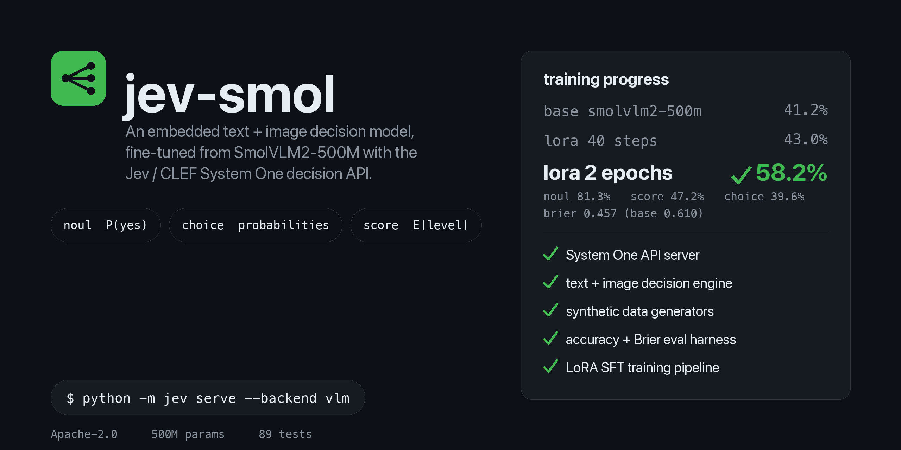

<p align="center">
  
</p>

# jev-smol

A small, **embeddable text + image decision model** with a [Jev / CLEF "System One"](https://blog.cloudflare.com/clef-decision-models/) compatible API, built on [SmolVLM2-500M-Video-Instruct](https://huggingface.co/HuggingFaceTB/SmolVLM2-500M-Video-Instruct) (~500M params, Apache-2.0). Runs on a laptop (Apple Silicon or CUDA), answers typed questions about a situation with calibrated per-option probabilities, and ships its own data pipelines, training code, and eval harness. 89 tests, no blobs in git: everything reproduces from source.

You describe a situation (`state`, optionally with up to 4 images) and a set of typed questions; jev answers every question jointly with per-option probabilities, the same wire contract as TypeSafe's Jev System One API and Cloudflare's CLEF decision models, at a size that runs on-device.

```json
POST /v1/systemone
{
  "model": "jev-mini",
  "state": "Checkout has been failing for every customer for the last hour.",
  "questions": {
    "urgent":   { "type": "noul",   "instructions": "Is this request urgent?",
                  "criteria": { "true": "Needs immediate action", "false": "Can wait" } },
    "team":     { "type": "choice", "instructions": "Which team should handle it?",
                  "criteria": { "billing": "Payments and refunds", "technical": "Outages and errors", "sales": "Plans and upgrades" } },
    "severity": { "type": "score",  "instructions": "How severe is the impact?",
                  "criteria": ["No impact", "Minor", "Major", "Critical"] }
  }
}

{
  "model": "jev-mini",
  "answers": {
    "urgent":   { "type": "noul", "noul": 0.93 },
    "team":     { "type": "choice", "choice": "technical",
                  "probabilities": { "billing": 0.03, "technical": 0.9, "sales": 0.07 },
                  "confidence": 0.9 },
    "severity": { "type": "score", "score": 2.71,
                  "legend": { "0": "No impact", "1": "Minor", "2": "Major", "3": "Critical" },
                  "probabilities": { "0": 0.02, "1": 0.09, "2": 0.81, "3": 0.08 },
                  "confidence": 0.81 }
  },
  "usage": { "input_tokens": 296, "output_tokens": 0 }
}
```

* **noul** — yes/no question → `noul` = P(true)
* **choice** — 2–255 options → argmax + full `probabilities` + `confidence`
* **score** — 2–10 ordered levels → expected level `sum(i·p_i)` + `legend` + `probabilities`
* **images** — CLEF extension: up to 4 PNG/JPEG/WebP inputs (data URL or `{content_type, base64}`); ≤4 MiB / 16 Mpx each
* floats are rounded to 4 decimals; `videos` is rejected with a clean 400 (not supported by this model)

## How it works

Inference is CLEF-style **logit-per-option scoring**, not free-form generation: the request is rendered into a `STATE:` + `SCHEMA FIELDS:` prompt (mirroring the published CLEF prompt template), and for every question each option's label is teacher-forced at its answer position (`{"team":{"type":"choice","choice":` …) and scored by mean token log-prob; a per-question softmax turns those into the response probabilities. The model is SFT-trained (LoRA on the language tower) to emit exactly this answers JSON, so the value position carries the decision.

## Quickstart

```bash
uv venv --python 3.12 .venv
uv pip install --python .venv/bin/python -e ".[api,data,dev]"          # core + API + data pipeline
uv pip install --python .venv/bin/python -r requirements-train.txt     # pinned training stack

# serve the real model (downloads ~1 GB weights on first use; fp32 on Apple Silicon)
.venv/bin/python -m jev serve --backend vlm --port 8080

# or a deterministic mock backend for development
.venv/bin/python -m jev serve --backend mock --port 8080

# one-shot decision from the CLI
.venv/bin/python -m jev decide --state "The deploy is green but latency doubled." \
  --questions '{"urgent": {"type": "noul"}, "severity": {"type": "score", "criteria": ["low","high"]}}' \
  --image screenshot.png
```

Python client: `jev.api.client.JevClient` (`decide(state, questions, images=None)`).

## Data pipeline

```bash
# small sample build (~30/source; verifies every source end-to-end)
.venv/bin/python -m jev.data.build --config configs/data_starter.yaml --sample --out data/processed

# full starter mix (~20k+ examples across 9 sources)
.venv/bin/python -m jev.data.build --config configs/data_starter.yaml --out data/processed

# validate outputs against the schema + assistant-target roundtrip
.venv/bin/python -m jev.data.validate data/processed/train.jsonl --root data/processed
```

Each source is converted into unified examples (`request` + gold `target` + `assistant_text`, optional `image`), validated against `jev.schema` at assembly time, and every failure is isolated into `manifest.json`. Sources (see `configs/data_starter.yaml` and `docs/research/datasets.md` for licenses):

| Source | Modality | Task shape |
| --- | --- | --- |
| `stanfordnlp/snli` | text | 3-way NLI → choice |
| `openbmb/UltraFeedback` | text | quality rating → score |
| `nvidia/Aegis-AI-Content-Safety-1.0` | text | safety → noul + category choice |
| `codelion/optillm-router-dataset` | text | LLM routing → choice |
| `SargeDev/jev-distill-corpus-v3` | text | native SystemOne requests (highest fidelity) |
| `Multimodal-Fatima/VQAv2_sample_train` | image | VQA → choice w/ distractors |
| `lmms-lab/textvqa` | image | scene-text VQA → choice w/ distractors |
| `jxie/coco_captions` | image | caption matching → choice |
| `lmms-lab/ai2d`, `lmms-lab/DocVQA` | image | disabled by default (license / size) |

### Synthetic data generators

Five deterministic domain generators produce unlimited, perfectly-labeled, CC0 training data (including PIL-drawn images) in the same unified format — no downloads, no license caveats:

| Domain | Modality | Decisions |
| --- | --- | --- |
| `support_triage` | text | urgency noul, team choice, severity/sentiment score |
| `moderation_policy` | text | policy violation noul, category choice, severity score |
| `ops_router` | text | incidents (priority/assign) + LLM prompt routing |
| `doc_images` | image | is_paid / total_over nouls, vendor choice, urgency score |
| `chart_images` | image | trend/peak choices, threshold noul, magnitude score |

```bash
.venv/bin/python -m jev.data.synthgen.build --domains all --out data/synthetic   # 3000 train / 500 val
.venv/bin/python -m jev.data.validate data/synthetic/train.jsonl --root data/synthetic
.venv/bin/python -m jev.train.sft --config configs/train_synth.yaml              # train on it
```

Labels are structurally balanced (no class > ~55% per question), golds are always derivable from the generated state/image, and every generator is unit-tested for determinism and schema conformance. Add a domain by dropping a module into `src/jev/data/synthgen/` implementing `generate(n, seed, images_dir, prefix)` and registering it in `__init__.py`.

## Training

```bash
.venv/bin/python scripts/make_synth_data.py                          # tiny synthetic set (offline check)
.venv/bin/python scripts/train_smoke.sh                              # 3-step LoRA smoke run (MPS fp32)

# real run — LoRA on the language tower only, completion-only loss
.venv/bin/python -m jev.train.sft --config configs/train_lora.yaml
.venv/bin/python -m jev.train.export --adapter runs/jev-mini-lora/adapter --out runs/merged
JEV_MODEL=runs/merged .venv/bin/python -m jev serve --backend vlm    # serve the fine-tune
```

Training uses TRL conversational prompt-completion SFT (assistant tokens only), `max_length=None` so image tokens are never truncated, and a LoRA `target_modules` regex asserted at startup to match **zero** vision-encoder modules (`lora_matches_vision == 0` in `train_summary.json`).

Training on a serious GPU? **[docs/GPU_TRAINING.md](docs/GPU_TRAINING.md)** is a self-contained runbook: setup, data, configs, eval, publishing weights to the Hugging Face Hub, and a list of already-solved gotchas.

## Evaluation

```bash
.venv/bin/python -m jev.eval --data data/synthetic/val_text.jsonl --root data/synthetic \
  --model runs/textfull/merged --limit 60 --out runs/evals/result.json
```

Accuracy + Brier + mean confidence per question type against gold labels (noul: P(true)≥0.5; choice: argmax; score: round of the expected level). `scripts/diag_scoring.py` compares greedy *generation* accuracy against engine *scoring* accuracy to detect train/inference misalignment.

Measured on 60 text-only synthetic val examples (2026-10-04, fixed engine):

| Model | Overall | Choice | Noul | Score | Brier |
| --- | --- | --- | --- | --- | --- |
| Base SmolVLM2-500M | 41.2% | 31.3% | 60.9% | 26.4% | 0.610 |
| LoRA 40 steps (0.36 ep) | 43.0% | 37.5% | 46.9% | 43.4% | 0.533 |
| LoRA 2 epochs | **58.2%** | 39.6% | **81.3%** | 47.2% | **0.457** |

Training clearly works (noul 61→81%, Brier −25%) but is not converged; choice questions with distractors are the weakest. The 2-epoch run took ~35 min on MPS, text-only.

## Layout

```
src/jev/schema.py       wire models + answer assembly (the API contract)
src/jev/prompting.py    STATE/SCHEMA FIELDS renderer + answers-JSON builder
src/jev/engine.py       engine interface, mock engine, registry
src/jev/engine_vlm.py   SmolVLM2 engine (clef-style per-option scoring)
src/jev/api/            FastAPI server (POST /v1/systemone), errors
src/jev/cli.py          `jev serve` / `jev decide`
src/jev/data/           dataset download/convert/validate pipeline + synth generators
src/jev/train/          LoRA SFT + adapter export
src/jev/eval.py         accuracy/Brier eval harness
docs/research/          CLEF/Jev API spec, SmolVLM2 fine-tuning notes, dataset survey
docs/GPU_TRAINING.md    self-contained runbook for training on a GPU box
scripts/make_banner.py  regenerates docs/assets/banner.png deterministically
```

## Status & roadmap

* [x] Jev/CLEF-compatible API server + client + CLI (89 tests passing)
* [x] SmolVLM2 engine with per-option scoring — verified on Apple Silicon (text + image)
* [x] Data pipeline over 9 public sources with per-source fault isolation
* [x] Synthetic data generators (5 domains, text + PIL images) — 3000-example set builds + validates + trains
* [x] Eval harness (accuracy/Brier vs gold) + train/inference alignment diagnostics; first real training runs measured
* [ ] Full-mix training run (real + synthetic, images included, more epochs) — current best: 58.2% overall on synthetic val after 2 text-only epochs
* [ ] Calibration pass (CLEF-style label smoothing / Brier loss / distillation from Jev outputs)
* [ ] Batching/KV-reuse in the engine for many-question requests

The base model answers before fine-tuning — expect meaningful-but-uncalibrated probabilities until the first real training run. Licenses: code Apache-2.0; see `manifest.json` for per-dataset licenses before shipping a trained checkpoint commercially (TextVQA images and Aegis need a second look).

## References

* [Cloudflare: CLEF decision models](https://blog.cloudflare.com/clef-decision-models/) · [Cloudflare/clef](https://huggingface.co/Cloudflare/clef) · [Cloudflare/clef-flash](https://huggingface.co/Cloudflare/clef-flash)
* [SmolVLM2-500M-Video-Instruct](https://huggingface.co/HuggingFaceTB/SmolVLM2-500M-Video-Instruct)
* Research notes: `docs/research/clef-api.md`, `docs/research/smolvlm2-finetuning.md`, `docs/research/datasets.md`
* Project journal (plain-language notes on why it's built this way, how training works, and the bugs fought along the way): [docs/journal/](docs/journal/01-why-this-shape.md)

## License

Apache-2.0 — see [LICENSE](LICENSE). Generated training data is CC0; upstream dataset licenses apply to their respective samples and are recorded per-source in `manifest.json` at build time.
